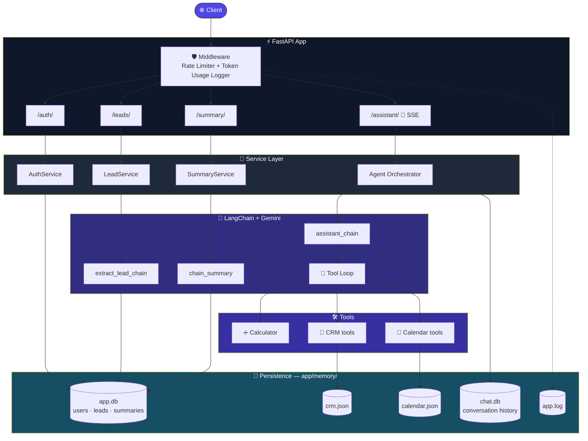
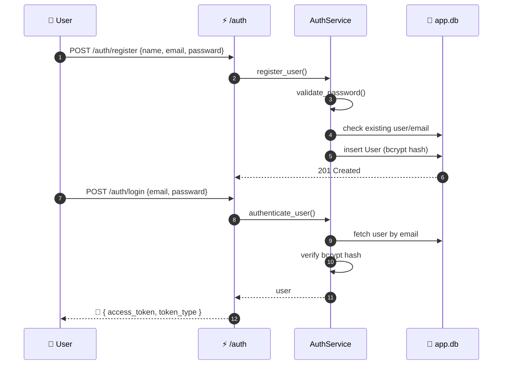
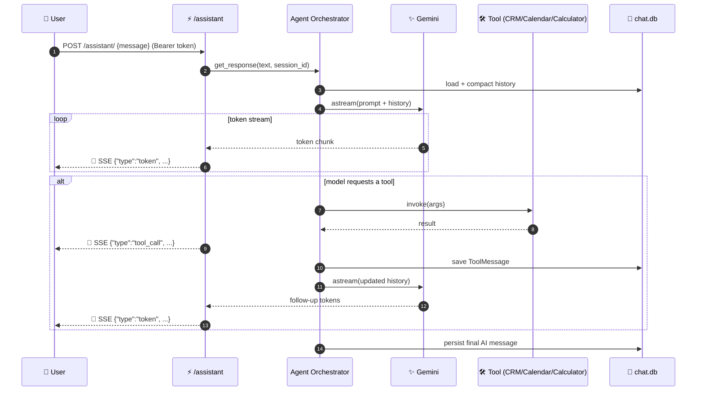
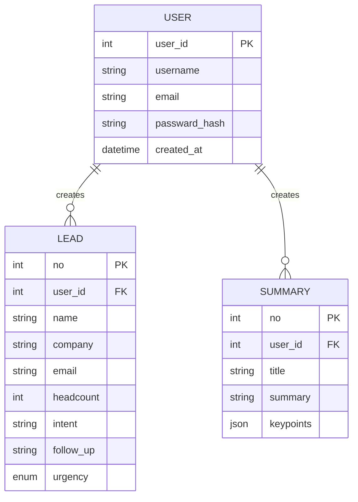

<div align="center">

```
 _   _                                ___              _    ____ ___
| \ | |_   ___   _____  ___  _ __    / _ \ _ __  ___   / \  |  _ \_ _|
|  \| | | | \ \ / / _ \/ _ \| '_ \  | | | | '_ \/ __| / _ \ | |_) | |
| |\  | |_| |\ V /  __/ (_) | |_) | | |_| | |_) \__ \/ ___ \|  __/| |
|_| \_|\__, | \_/ \___|\___/| .__/   \___/| .__/|___/_/   \_\_|  |___|
       |___/                |_|          |_|
```

### 🤖 AI-powered operations backend — auth, lead extraction, summarization & a tool-calling assistant


</div>

<br>

> **TL;DR** — a FastAPI service that (1) authenticates users with JWT, (2) turns raw text into structured leads and summaries using Gemini, and (3) runs a streaming, tool-calling AI assistant that can manage CRM contacts and calendar events on the user's behalf, with persistent per-user memory.

---

## 📑 Table of Contents

- [✨ Features](#-features)
- [🗺️ Architecture](#️-architecture)
- [🔄 Request Flows](#-request-flows)
- [🗄️ Data Model](#️-data-model)
- [🧰 Tech Stack](#-tech-stack)
- [📁 Project Structure](#-project-structure)
- [⚙️ Installation](#️-installation)
- [🐳 Docker Usage](#-docker-usage)
- [🐙 Docker Compose Usage](#-docker-compose-usage)
- [📡 API Reference & cURL Examples](#-api-reference--curl-examples)
- [📝 Notes](#-notes)

---

## ✨ Features

<table>
<tr>
<td width="33%" valign="top">

### 🔐 Auth
- JWT register / login
- Username & email update
- Bcrypt password hashing
- Per-user rate limiting

</td>
<td width="33%" valign="top">

### 🧠 AI Extraction
- Text → structured **Lead**
- Text → **Summary** (title, summary, key points)
- Gemini structured output
- Auto-retry on model failure

</td>
<td width="33%" valign="top">

### 🤝 AI Assistant
- Tool-calling agent (calculator, CRM, calendar)
- Streamed via **SSE**, token-by-token
- Persistent per-user memory
- Auto-compacts long conversations

</td>
</tr>
</table>

**Plus:** structured request logging with token-usage/latency tracking on every AI call, Dockerized deployment, and a `pytest` suite with an isolated in-memory DB per test.

---

## 🗺️ Architecture



---

## 🔄 Request Flows

<details open>
<summary><strong>🔐 Register → Login</strong></summary>



</details>

<details>
<summary><strong>🤝 AI Assistant — streaming tool-calling loop</strong></summary>



</details>

---

## 🗄️ Data Model



---

## 🧰 Tech Stack

| Layer | Technology |
|---|---|
| 🌐 API framework | FastAPI + Uvicorn |
| 🦜 AI / LLM orchestration | LangChain (`core`, `community`, `google-genai`) + Google Gemini |
| 💾 Database / ORM | SQLModel (SQLAlchemy) over SQLite, `aiosqlite` for async chat history |
| 🔐 Auth | `python-jose` (JWT), `passlib` + `bcrypt` (password hashing) |
| ✅ Validation / config | Pydantic v2, `pydantic-settings` |
| 🚦 Rate limiting | `slowapi` |
| 📡 Streaming | `sse-starlette` (Server-Sent Events) |
| 🧪 Testing | `pytest`, `httpx` |
| 🐳 Containerization | Docker, Docker Compose |

---

## 📁 Project Structure

```
Nyvexa-Ops-API/
├── app/
│   ├── main.py                 # FastAPI app, router/middleware wiring, health check
│   ├── auth/                   # Password hashing, JWT encode/decode, get_user dependency
│   ├── core/                   # Settings, DB engine, LLM factory, agent orchestration, logging, rate limiter
│   ├── chains/                 # LangChain prompt + model chains (assistant, lead extraction, summarizer)
│   ├── tools/                  # LangChain @tool definitions (calculator, CRM, calendar)
│   ├── models/                 # SQLModel table models (User, Lead, Summary)
│   ├── schemas/                # Pydantic request/response schemas
│   ├── repositories/           # Thin DB access layer (one per model)
│   ├── services/                # Business logic tying routers → chains/repositories
│   ├── routers/                 # FastAPI route definitions (auth, leads, summary, assistant)
│   ├── middleware/               # Token-usage logging middleware
│   ├── utils/                    # History store, compaction, tool loop, usage tracking, JSON-backed CRM/calendar stores
│   └── memory/                   # Runtime data: app.db, chat.db, crm.json, calendar.json, app.log
├── tests/                       # pytest suite (auth, leads, summary, assistant) + shared test client helper
├── requirements.txt
├── Dockerfile
├── docker-compose.yml
├── pytest.ini
└── .env                         # Local environment variables (not committed)
```

---

## ⚙️ Installation

### Prerequisites
- 🐍 Python 3.13+
- 🔑 A [Google Gemini API key](https://aistudio.google.com/apikey)

### Steps

```bash
# 1️⃣ Clone the repo
git clone <your-repo-url>
cd Nyvexa-Ops-API

# 2️⃣ Create and activate a virtual environment
python -m venv .venv
# Windows
.venv\Scripts\activate
# macOS/Linux
source .venv/bin/activate

# 3️⃣ Install dependencies
pip install -r requirements.txt

# 4️⃣ Configure environment variables
cp .env.example .env   # or create .env manually (see below)
```

### 🔧 Environment variables

Create a `.env` file in the project root:

```env
# Required
GEMINI_API_KEY=your_gemini_api_key
SECRET_KEY=a_long_random_secret_for_jwt_signing

# Optional (defaults shown)
GEMINI_MODEL=gemini-2.5-flash
TEMPERATURE=0

# Optional — LangSmith tracing/observability
LANGSMITH_TRACING=true
LANGSMITH_ENDPOINT=https://api.smith.langchain.com
LANGSMITH_API_KEY=your_langsmith_key
LANGSMITH_PROJECT="Nyvexa Agent API"
```

> ⚠️ **Heads up:** your current `.env` has live-looking `GEMINI_API_KEY` / `LANGSMITH_API_KEY` values and a weak `SECRET_KEY`. It's correctly excluded by `.gitignore`, but worth rotating those keys as a precaution since they were pasted into this session.

### ▶️ Run locally

```bash
uvicorn app.main:app --reload
```

API → `http://localhost:8000` · Interactive docs → `http://localhost:8000/docs`

### 🧪 Run tests

```bash
pytest
```

---

## 🐳 Docker Usage

```bash
# Build the image
docker build -t nyvexa-ops-api .

# Run it (reads secrets from .env)
docker run -d --name nyvexa-ops-api -p 8000:8000 --env-file .env nyvexa-ops-api
```

API → `http://localhost:8000`

---

## 🐙 Docker Compose Usage

```bash
# Build and start (foreground)
docker compose up --build

# Build and start (background)
docker compose up -d --build

# Stop
docker compose down
```

This builds the image from the local `Dockerfile`, loads variables from `.env`, mounts the project directory into the container for live code sync, and exposes the API on port `8000`.

---

## 📡 API Reference & cURL Examples

Base URL: `http://localhost:8000`

### ❤️ Health Check

```bash
curl http://localhost:8000/
```

<details>
<summary><strong>🔐 Authentication endpoints</strong></summary>

**Register** — `POST /auth/register` · 🚦 3/minute

```bash
curl -X POST http://localhost:8000/auth/register \
  -H "Content-Type: application/json" \
  -d '{
        "name": "Alice",
        "email": "alice@example.com",
        "passward": "Password123"
      }'
```

**Login** — `POST /auth/login` · 🚦 3/minute

```bash
curl -X POST http://localhost:8000/auth/login \
  -H "Content-Type: application/json" \
  -d '{
        "email": "alice@example.com",
        "passward": "Password123"
      }'
```

Response:
```json
{ "access_token": "<jwt>", "token_type": "bearer" }
```

Export it for the next calls:
```bash
export TOKEN="<jwt>"
```

**Update username** — `POST /auth/update-username`

```bash
curl -X POST http://localhost:8000/auth/update-username \
  -H "Content-Type: application/json" \
  -d '{ "old_username": "Alice", "new_username": "alice_ops" }'
```

**Update email** — `POST /auth/update-email`

```bash
curl -X POST http://localhost:8000/auth/update-email \
  -H "Content-Type: application/json" \
  -d '{ "old_email": "alice@example.com", "new_email": "alice.ops@example.com" }'
```

</details>

<details>
<summary><strong>🧠 Lead Extraction</strong></summary>

**Extract a lead from text** — `POST /leads/extract` · 🚦 10/minute · 🔒 requires auth

```bash
curl -X POST http://localhost:8000/leads/extract \
  -H "Authorization: Bearer $TOKEN" \
  -H "Content-Type: application/json" \
  -d '{
        "text": "Hi, this is John from Acme Corp (about 50 employees). We need a CRM integration ASAP, please call me back today at john@acme.com."
      }'
```

</details>

<details>
<summary><strong>📝 Summarization</strong></summary>

**Summarize text** — `POST /summary/` · 🚦 10/minute · 🔒 requires auth

```bash
curl -X POST http://localhost:8000/summary/ \
  -H "Authorization: Bearer $TOKEN" \
  -H "Content-Type: application/json" \
  -d '{
        "text": "Long meeting transcript or notes go here..."
      }'
```

</details>

<details open>
<summary><strong>🤝 AI Assistant (streaming)</strong></summary>

**Chat with the assistant** — `POST /assistant/` · 🚦 20/minute · 🔒 requires auth · 📡 SSE stream

```bash
curl -N -X POST http://localhost:8000/assistant/ \
  -H "Authorization: Bearer $TOKEN" \
  -H "Content-Type: application/json" \
  -H "Accept: text/event-stream" \
  -d '{ "message": "Add a new contact: Sarah from Globex, sarah@globex.com, and schedule a call with her tomorrow at 3pm for 30 minutes." }'
```

`-N` disables curl's output buffering so you see tokens as they stream. The response is a stream of SSE events, each a JSON payload:

```json
{"type": "token", "content": "Sure"}
{"type": "tool_call", "tool": "add_contact"}
{"type": "token", "content": "'ve added Sarah..."}
```

The assistant remembers each user's conversation across requests, keyed by the authenticated `username` as the session id.

</details>

---

## 📝 Notes

- 📇 The CRM and calendar tools persist to simple JSON files (`app/memory/crm.json`, `app/memory/calendar.json`) rather than the SQL database — fine for a single-instance demo, but not safe for concurrent writers or multi-instance deployments.
- 💬 Conversation history is stored per-session in `app/memory/chat.db`, and an in-process dictionary caches active session handles — running multiple API workers/replicas means each will have its own cache, though all read/write the same SQLite file.
- 🚦 Rate limits are keyed per authenticated user where available, falling back to client IP for unauthenticated requests (registration/login).

<div align="center">

---

Built with ⚡ FastAPI · 🦜 LangChain · ✨ Gemini

</div>
